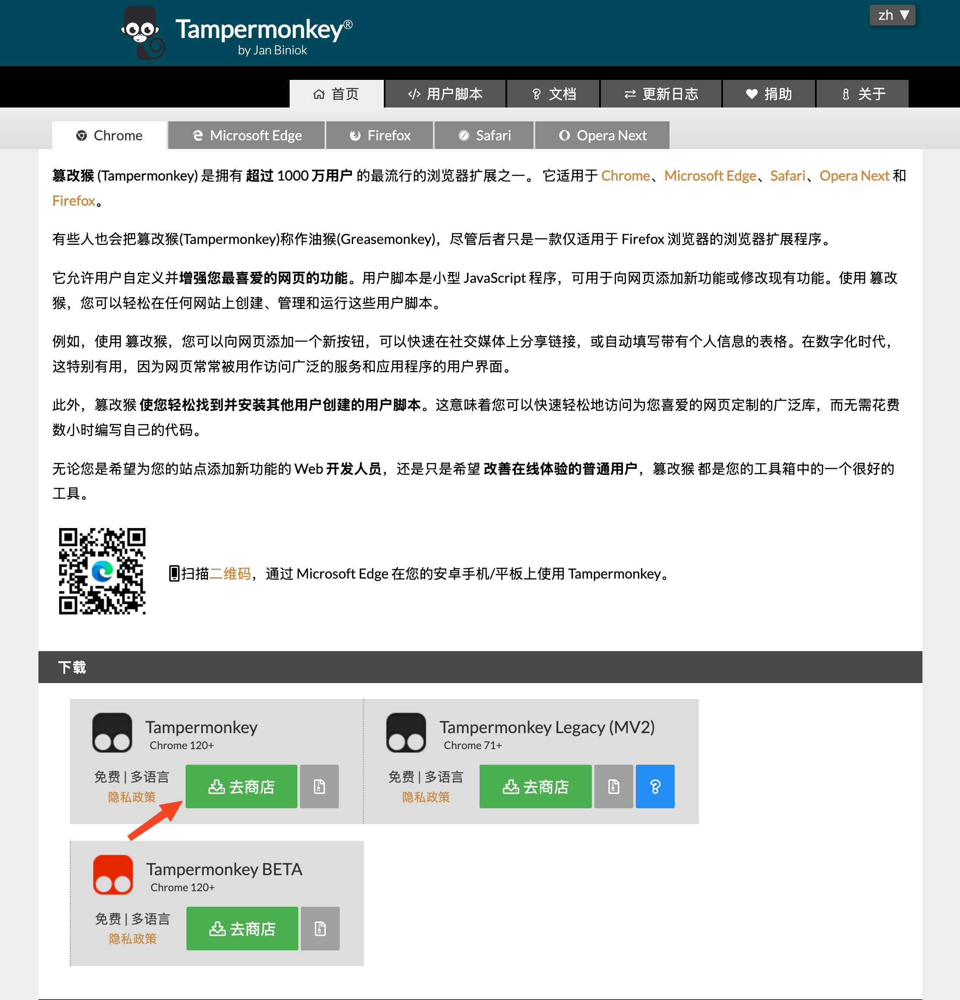

# 知识星球复制、剪藏助手（顶呱呱版）

GitHub：[项目地址](https://github.com/beta4x/frontend-ynm3k/blob/main/js/zsxq-tamper-content.js) | [使用帮助](https://github.com/beta4x/frontend-ynm3k/blob/main/md/zsxq-tamper-content.md)

## 功能介绍

主要功能：

- 解除复制限制，允许复制知识星球帖子内容。
- 解决用网页剪藏工具剪藏时，换行符丢失的问题。

  - 在使用一些笔记软件的网页剪藏工具（eg. 思源、OneNote、Notion、Obsidian、Logseq、印象笔记）剪藏知识星球的帖子内容时，存在换行符丢失的问题，用本插件可以解决。

上述功能，在知识星球的列表页、详情页都支持。

## 安装方法

安装分两个步骤：

1. 安装插件 [Tampermonkey](https://www.tampermonkey.net/index.php)，该插件提供了一个可以管理、运行 JavaScript 脚本的环境。可以从 [Tampermonkey 官网](https://www.tampermonkey.net/index.php)链接点击进入浏览器应用商店，安装插件。

  
  

2. 在 Tampermonkey 中安装我们提供的[知识星球复制、剪藏助手（顶呱呱版）](https://greasyfork.org/en/scripts/574419-%E7%9F%A5%E8%AF%86%E6%98%9F%E7%90%83%E5%A4%8D%E5%88%B6-%E5%89%AA%E8%97%8F%E5%8A%A9%E6%89%8B-%E9%A1%B6%E5%91%B1%E5%91%B1%E7%89%88)脚本 。可以打开 Greasy Fork 上的[知识星球复制、剪藏助手（顶呱呱版）](https://greasyfork.org/en/scripts/574419-%E7%9F%A5%E8%AF%86%E6%98%9F%E7%90%83%E5%A4%8D%E5%88%B6-%E5%89%AA%E8%97%8F%E5%8A%A9%E6%89%8B-%E9%A1%B6%E5%91%B1%E5%91%B1%E7%89%88)链接，点击「安装此脚本」即可安装完成。

  

## 使用注意事项

- 在用网页剪藏工具时，需要**完整地剪藏完帖子正文**，这样才能解决换行符丢失的问题。

  - 原因：目前解决换行符丢失问题的方法是，将整个帖子正文部分用 `pre` 标签包裹起来，即 `<pre>正文</pre>`。因此只有当剪藏的范围完全覆盖正文首尾时，`pre` 标签才能生效。
  - 优缺点分析

    - 优点：实现简单；且能完整地保存正文里文本的样式（eg. 空格符、换行符、ASCII art 等）。
    - 缺点：如果想只剪藏正文的部分内容，无法实现预期效果。目前建议先剪藏整个帖子正文，然后在笔记软件里删掉自己不需要的部分。:-(
  - 后续会视反馈情况决定是否对实现方案做调整。

  
  

